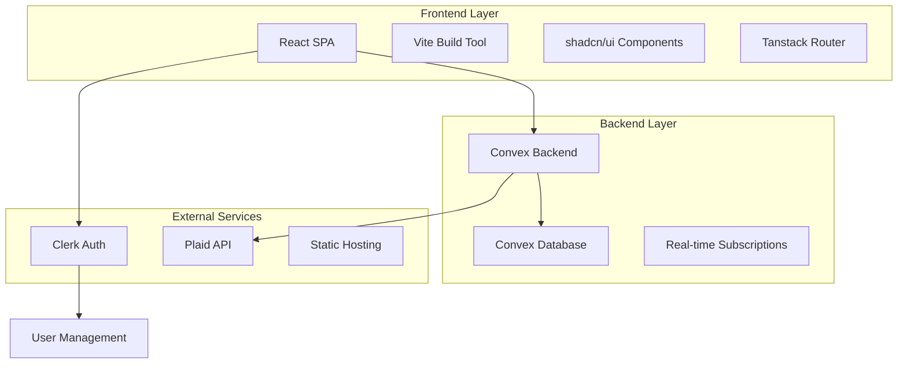

# Design Document

## Overview

The Debty application is a comprehensive debt management system built with modern web technologies, designed to help users track debts, record payments, and optimize their debt elimination strategies. The system follows a serverless architecture with real-time data synchronization, providing users with immediate feedback and up-to-date financial projections.

The application serves three primary user personas: The Overwhelmed Juggler (needs simplicity), The Savvy Optimizer (wants advanced features), and The Motivated Achiever (seeks progress tracking). The design balances simplicity for basic users while providing advanced features for power users.

## Architecture

### System Architecture

The application follows a modern serverless architecture pattern:



### Technology Stack

**Frontend:**

- React 19+ with React Compiler for optimal performance
- Vite for fast development and optimized builds
- Tanstack Router for type-safe routing
- shadcn/ui built on Radix UI and Tailwind CSS
- Tanstack Form for complex form management
- Recharts for data visualization

**Backend:**

- Convex for serverless backend with real-time capabilities
- Clerk for authentication and user management
- Plaid API for bank integration (future phase)

**Infrastructure:**

- Static hosting (Netlify/Vercel/Cloudflare Pages)
- Convex Cloud for backend services
- CDN for asset delivery

## Components and Interfaces

### Core Data Models

#### Debt Model

```typescript
interface Debt {
  _id: string;
  userId: string;
  name: string;
  type:
    | "credit_card"
    | "personal_loan"
    | "student_loan"
    | "mortgage"
    | "auto_loan"
    | "other";
  currentBalance: number;
  originalBalance: number;
  interestRate: number;
  minimumPayment: number;
  dueDate: number; // Day of month (1-31)
  isActive: boolean;
  createdAt: number;
  updatedAt: number;
}
```

#### Payment Model

```typescript
interface Payment {
  _id: string;
  userId: string;
  debtId: string;
  amount: number;
  paymentDate: number;
  principal: number;
  interest: number;
  remainingBalance: number;
  note?: string;
  createdAt: number;
}
```

#### Strategy Model

```typescript
interface Strategy {
  _id: string;
  userId: string;
  name: string;
  type: "avalanche" | "snowball" | "custom";
  monthlyBudget: number;
  extraPayment: number;
  debtPriorities?: string[]; // For custom strategies
  isActive: boolean;
  createdAt: number;
}
```

### Component Architecture

#### Page Components

- **Landing Page**: Marketing and feature overview
- **Authentication Pages**: Sign-in/sign-up with Clerk integration
- **Dashboard**: Overview with key metrics and visualizations
- **Debt Management**: CRUD operations for debts
- **Payment Recording**: Form for logging payments
- **Strategy Selection**: Choose and compare debt elimination strategies
- **Settings**: User preferences and account management

#### Shared Components

- **Layout Components**: Root, Auth, and Dashboard layouts
- **UI Components**: Leveraging shadcn/ui component library
- **Form Components**: Reusable form elements with validation
- **Chart Components**: Data visualization using Recharts
- **Navigation**: Responsive navigation with mobile support

### API Design

#### Convex Functions

**Debt Operations:**

```typescript
// Query functions
export const listDebts = query({
  handler: async (ctx) => {
    // Return user's active debts sorted by priority
  },
});

// Mutation functions
export const createDebt = mutation({
  args: { name: v.string(), type: v.string() /* ... */ },
  handler: async (ctx, args) => {
    // Create new debt with validation
  },
});

export const updateDebt = mutation({
  args: { id: v.id("debts") /* updates */ },
  handler: async (ctx, args) => {
    // Update debt and recalculate projections
  },
});
```

**Payment Operations:**

```typescript
export const recordPayment = mutation({
  args: { debtId: v.id("debts"), amount: v.number() /* ... */ },
  handler: async (ctx, args) => {
    // Record payment, update balance, calculate interest/principal split
  },
});
```

**Strategy Operations:**

```typescript
export const calculateProjections = query({
  args: { strategyType: v.string(), monthlyBudget: v.number() },
  handler: async (ctx, args) => {
    // Calculate debt payoff projections based on strategy
  },
});
```

## Data Models

### Database Schema

The application uses Convex's document-based database with the following schema:

```typescript
export default defineSchema({
  debts: defineTable({
    userId: v.string(),
    name: v.string(),
    type: v.union(v.literal("credit_card") /* ... */),
    currentBalance: v.number(),
    originalBalance: v.number(),
    interestRate: v.number(),
    minimumPayment: v.number(),
    dueDate: v.number(),
    isActive: v.boolean(),
  })
    .index("by_user", ["userId"])
    .index("by_user_active", ["userId", "isActive"]),

  payments: defineTable({
    userId: v.string(),
    debtId: v.id("debts"),
    amount: v.number(),
    paymentDate: v.number(),
    principal: v.number(),
    interest: v.number(),
    remainingBalance: v.number(),
    note: v.optional(v.string()),
  })
    .index("by_user", ["userId"])
    .index("by_debt", ["debtId"])
    .index("by_date", ["paymentDate"]),

  strategies: defineTable({
    userId: v.string(),
    name: v.string(),
    type: v.union(
      v.literal("avalanche"),
      v.literal("snowball"),
      v.literal("custom")
    ),
    monthlyBudget: v.number(),
    extraPayment: v.number(),
    debtPriorities: v.optional(v.array(v.id("debts"))),
    isActive: v.boolean(),
  })
    .index("by_user", ["userId"])
    .index("by_user_active", ["userId", "isActive"]),
});
```

### Data Relationships

- Users (managed by Clerk) have many Debts
- Debts have many Payments
- Users have many Strategies
- Strategies generate Projections

### Data Validation

All data inputs are validated using Zod schemas:

- Debt amounts must be positive numbers
- Interest rates must be between 0-100%
- Payment amounts cannot exceed current balance
- Due dates must be valid calendar days (1-31)

## Error Handling

### Client-Side Error Handling

**Form Validation:**

- Real-time validation using Tanstack Form with Zod
- Clear error messages with specific guidance
- Prevention of invalid form submission

**Network Errors:**

- Retry logic with exponential backoff
- Offline state detection and graceful degradation
- User-friendly error messages for connection issues

**Component Error Boundaries:**

- React Error Boundaries to catch component crashes
- Fallback UI with recovery options
- Error reporting to monitoring service

### Server-Side Error Handling

**Authentication Errors:**

- Proper handling of unauthenticated requests
- Token refresh logic for expired sessions
- Clear error messages for auth failures

**Database Errors:**

- Transaction rollback for failed operations
- Constraint violation handling
- Data consistency checks

**Calculation Errors:**

- Input validation for financial calculations
- Handling of edge cases (zero balances, negative rates)
- Fallback values for invalid calculations

## Testing Strategy

### Unit Testing

**Component Testing:**

- React Testing Library for component behavior
- Mock external dependencies (Convex, Clerk)
- Test user interactions and state changes

**Calculation Testing:**

- Comprehensive tests for financial algorithms
- Edge case testing (zero balances, high interest rates)
- Precision testing for monetary calculations

**Utility Function Testing:**

- Input validation functions
- Date/number formatting utilities
- Helper functions for data transformation

### Integration Testing

**API Integration:**

- Test Convex function calls with real backend
- Authentication flow testing
- Data persistence verification

**User Flow Testing:**

- End-to-end user journeys
- Cross-component data flow
- Real-time update verification

### End-to-End Testing

**Critical User Paths:**

- User registration and onboarding
- Adding and managing debts
- Recording payments and seeing updates
- Strategy selection and projection viewing

**Performance Testing:**

- Page load times under various conditions
- Calculation performance with large datasets
- Real-time update latency

### Accessibility Testing

**WCAG Compliance:**

- Keyboard navigation support
- Screen reader compatibility
- Color contrast validation
- Focus management

**Responsive Design:**

- Mobile device testing
- Touch interaction validation
- Cross-browser compatibility

The testing strategy ensures 80% code coverage with focus on critical financial calculations and user workflows. Automated testing runs on every commit with deployment blocked on test failures.
